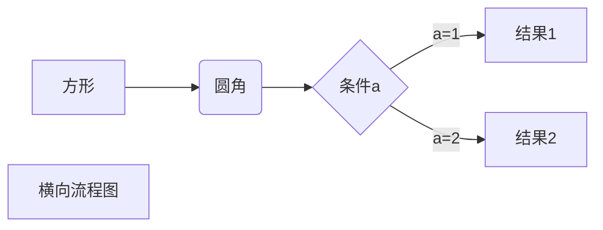
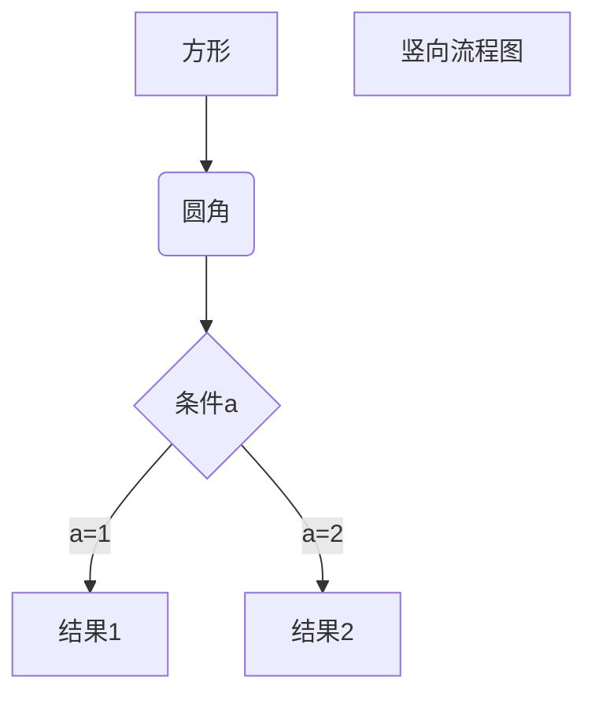
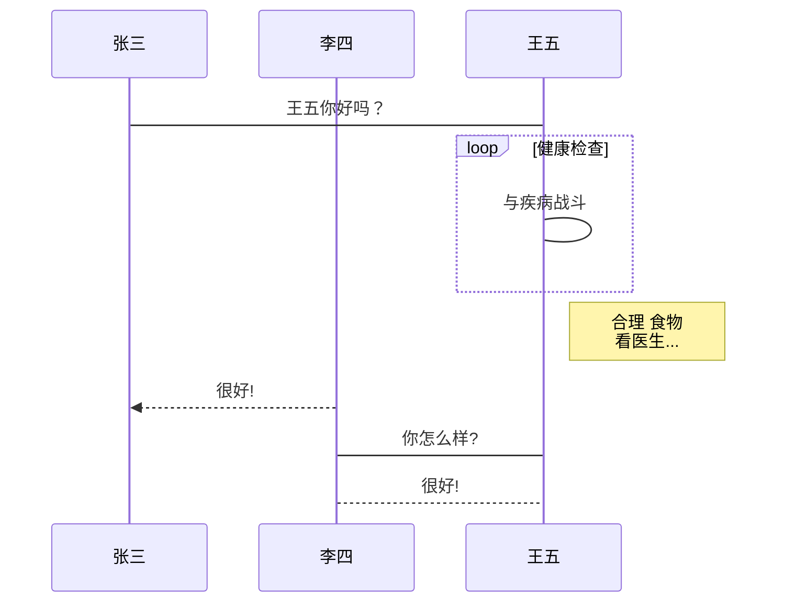
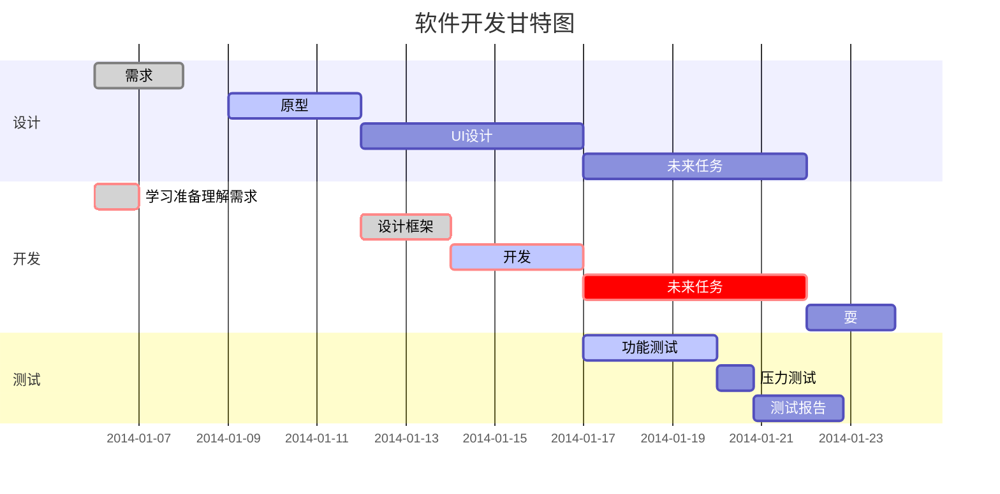

# Markdown 基本语法

Markdown 是一种纯文本格式的标记语言。通过简单的标记语法，它可以使普通文本内容具有一定的格式。

**推荐软件：Typora**

## 一、标题

在想要设置为标题的文字前面加#来表示
一个#是一级标题，二个#是二级标题，以此类推。支持六级标题。
注：标准语法一般在#后跟个空格再写文字，貌似简书不加空格也行。
示例：

```
# 这是一级标题
## 这是二级标题
### 这是三级标题
#### 这是四级标题
##### 这是五级标题
###### 这是六级标题
```

效果如下：

# 这是一级标题

## 这是二级标

### 这是三级标题

#### 这是四级标题

##### 这是五级标题

###### 这是六级标题

## 二、字体

- 加粗
  要加粗的文字左右分别用两个\*号包起来
- 斜体
  要倾斜的文字左右分别用一个\*号包起来
- 斜体加粗
  要倾斜和加粗的文字左右分别用三个\*号包起来
- 删除线
  要加删除线的文字左右分别用两个~~号包起来

示例：

```
**这是加粗的文字**
_这是倾斜的文字_`
**_这是斜体加粗的文字_**
~~这是加删除线的文字~~
```

效果如下：

**这是加粗的文字**

_这是倾斜的文字_

**_这是斜体加粗的文字_**

~~这是加删除线的文字~~

## 三、引用

在引用的文字前加>即可。引用也可以嵌套，如加两个>>三个>>>
n 个...
貌似可以一直加下去，但没神马卵用

示例：

```
> 这是引用的内容
>
> > 这是引用的内容
> >
> > > > > > > > > > 这是引用的内容
> > > > > > > > > >
```

效果如下：

> 这是引用的内容
> 
> > 这是引用的内容
> > 
> > > > > > > > > > 这是引用的内容

## 四、分割线

三个或者三个以上的 - 或者 \* 都可以。

示例：

```
---
---
---
---
```

效果如下：
可以看到，显示效果是一样的。

---

---

---

---

## 五、图片

语法：

```

```

图片 alt 就是显示在图片下面的文字，相当于对图片内容的解释。
图片 title 是图片的标题，当鼠标移到图片上时显示的内容。title 可加可不加
示例：

```

```

效果如下：


## 六、超链接

语法：

```
[超链接名](超链接地址 "超链接title")
title 可加可不加
```

示例：

```
[简书](http://jianshu.com)
[百度](http://baidu.com)
```

效果如下：
[简书](http://jianshu.com)
[百度](http://baidu.com)

注：Markdown 本身语法不支持链接在新页面中打开，貌似简书做了处理，是可以的。别的平台可能就不行了，如果想要在新页面中打开的话可以用 html 语言的 a 标签代替。

<a href="超链接地址" target="_blank">超链接名</a>

示例

```
<a href="https://www.jianshu.com/u/1f5ac0cf6a8b" target="_blank">简书</a>
```

## 七、列表

### 1.无序列表

语法：
无序列表用 - + \* 任何一种都可以

```
- 列表内容

* 列表内容

- 列表内容
```

注意：- + \* 跟内容之间都要有一个空格

效果如下：

- 列表内容
* 列表内容
- 列表内容

### 2.有序列表

语法：
数字加点

```
1. 列表内容
2. 列表内容
3. 列表内容
```

注意：序号跟内容之间要有空格
效果如下：

1. 列表内容
2. 列表内容
3. 列表内容

### 3.列表嵌套

**上一级和下一级之间敲三个空格即可**

- 一级无序列表内容
  
  - 二级无序列表内容
  - 二级无序列表内容
  - 二级无序列表内容

- 一级无序列表内容
  
  1. 二级有序列表内容
  2. 二级有序列表内容
  3. 二级有序列表内容

## 八、表格

语法：

```
| 表头 | 表头 | 表头 |
| ---- | :--: | ---: |
| 内容 | 内容 | 内容 |
| 内容 | 内容 | 内容 |

第二行分割表头和内容。

- 有一个就行，为了对齐，多加了几个
  文字默认居左 -两边加：表示文字居中 -右边加：表示文字居右
  注：原生的语法两边都要用 | 包起来。此处省略
```

示例：

```
| 姓名 | 技能 | 排行 |
| ---- | :--: | ---: |
| 刘备 |  哭  | 大哥 |
| 关羽 |  打  | 二哥 |
| 张飞 |  骂  | 三弟 |
```

效果如下：
| 姓名 | 技能 | 排行 |
| ---- | :--: | ---: |
| 刘备 | 哭 | 大哥 |
| 关羽 | 打 | 二哥 |
| 张飞 | 骂 | 三弟 |

## 九、代码

语法：
单行代码：代码之间分别用一个反引号包起来

```
    `代码内容`
```

代码块：代码之间分别用三个反引号包起来，且两边的反引号单独占一行

```
代码...
代码...
代码...
```

注：为了防止转译，前后三个反引号处加了小括号，实际是没有的。这里只是用来演示，实际中去掉两边小括号即可。

示例：

`单行代码`

`create database hero;`

代码块

```
function fun(){
    echo "这是一句非常牛逼的代码";
}
fun();
```

## 十、流程图

### 1.横向流程图

```


```


### 2. 竖向流程图

```


```


### 3. 标准流程图

```
```flow
st=>start: 开始框
op=>operation: 处理框
cond=>condition: 判断框(是或否?)
sub1=>subroutine: 子流程
io=>inputoutput: 输入输出框
e=>end: 结束框
st->op->cond
cond(yes)->io->e
cond(no)->sub1(right)->op
```

```
```flow
st=>start: 开始框
op=>operation: 处理框
cond=>condition: 判断框(是或否?)
sub1=>subroutine: 子流程
io=>inputoutput: 输入输出框
e=>end: 结束框
st->op->cond
cond(yes)->io->e
cond(no)->sub1(right)->op
```

### 4. 标准流程图横向

```
```flow
st=>start: 开始框
op=>operation: 处理框
cond=>condition: 判断框(是或否?)
sub1=>subroutine: 子流程
io=>inputoutput: 输入输出框
e=>end: 结束框
st(right)->op(right)->cond
cond(yes)->io(bottom)->e
cond(no)->sub1(right)->op
```

```
```flow
st=>start: 开始框
op=>operation: 处理框
cond=>condition: 判断框(是或否?)
sub1=>subroutine: 子流程
io=>inputoutput: 输入输出框
e=>end: 结束框
st(right)->op(right)->cond
cond(yes)->io(bottom)->e
cond(no)->sub1(right)->op
```

### 5. UML 时序图

```
```sequence
对象A->对象B: 对象B你好吗?（请求）
Note right of 对象B: 对象B的描述
Note left of 对象A: 对象A的描述(提示)
对象B-->对象A: 我很好(响应)
对象A->对象B: 你真的好吗？
```

```
```sequence
对象A->对象B: 对象B你好吗?（请求）
Note right of 对象B: 对象B的描述
Note left of 对象A: 对象A的描述(提示)
对象B-->对象A: 我很好(响应)
对象A->对象B: 你真的好吗？
```

### 6. UML 时序图复杂样例

```
```sequence
Title: 标题：复杂使用
对象A->对象B: 对象B你好吗?（请求）
Note right of 对象B: 对象B的描述
Note left of 对象A: 对象A的描述(提示)
对象B-->对象A: 我很好(响应)
对象B->小三: 你好吗
小三-->>对象A: 对象B找我了
对象A->对象B: 你真的好吗？
Note over 小三,对象B: 我们是朋友
participant C
Note right of C: 没人陪我玩
```

```
```sequence
Title: 标题：复杂使用
对象A->对象B: 对象B你好吗?（请求）
Note right of 对象B: 对象B的描述
Note left of 对象A: 对象A的描述(提示)
对象B-->对象A: 我很好(响应)
对象B->小三: 你好吗
小三-->>对象A: 对象B找我了
对象A->对象B: 你真的好吗？
Note over 小三,对象B: 我们是朋友
participant C
Note right of C: 没人陪我玩
```

### 7. UML 标准时序图

```


```


### 8. 甘特图样例

```


```

